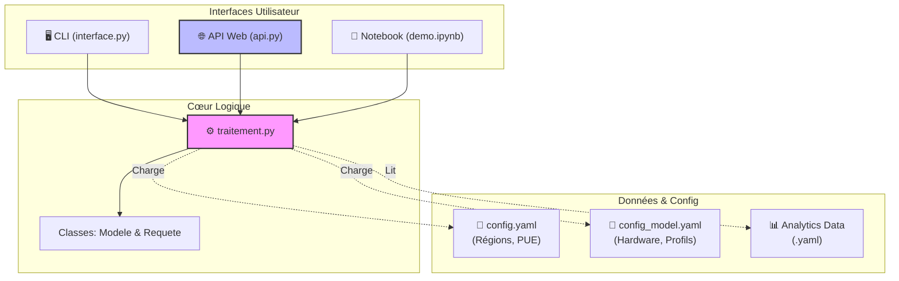
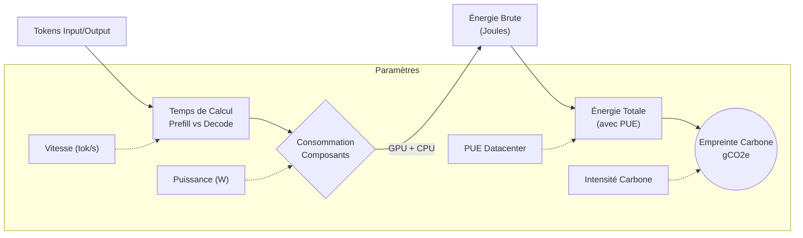

# 🌍 Calculateur d'Empreinte Carbone GenAI

Ce projet est un outil modulaire permettant d'estimer la consommation énergétique (kWh) et l'empreinte carbone (gCO2e) des requêtes adressées à des modèles de langage (LLM).

Il prend en compte les spécificités matérielles (GPU/CPU), l'efficacité énergétique du datacenter (PUE) et le mix électrique local (Intensité Carbone).

## 📊 Architecture du Projet

Le projet est conçu de manière modulaire : le cœur logique (`traitement.py`) est isolé et peut être appelé par plusieurs interfaces (Ligne de commande, API Web ou Notebook).



## 📂 Structure des Fichiers

```text
.
├── api.py           # Serveur API (FastAPI) pour intégration web
├── interface.py     # Interface CLI simplifiée (Façade)
├── traitement.py    # Logique métier (Calculs, Classes Modele/Requete)
├── test.py          # Tests unitaires et d'intégration
├── demo.ipynb       # Notebook d'analyse de données
├── requirements.txt # Dépendances Python
├── config/          # Dossier de configuration
│   ├── config.yaml        # Paramètres régionaux
│   └── config_model.yaml  # Specs Hardware & Profils
└── data/            # Données d'entrée
    └── 2025-FluidTopics-daily-analytics.yaml
```

## 🚀 Installation

1. **Prérequis** : Python 3.10 ou supérieur.
2. **Installation des dépendances** :

```bash
pip install -r requirements.txt
```

*(Dépendances principales : `fastapi`, `uvicorn`, `pyyaml`, `pandas`, `seaborn`, `pydantic`)*

---

## 🛠️ Utilisation

### 1. En Ligne de Commande (CLI)
Idéal pour des estimations rapides sans lancer de serveur.

```bash
# Exemple : Requête de 2000 tokens en entrée, 500 en sortie, hébergée aux USA
python interface.py --in_tok 2000 --out_tok 500 --region usa
```

### 2. Via l'API (FastAPI)
Pour intégrer le calculateur dans une application externe.

1. **Lancer le serveur :**
   ```bash
   uvicorn api:app --reload
   ```
2. **Accéder à la doc interactive :** `http://127.0.0.1:8000/docs`
3. **Tester avec `curl` :**

   ```bash
   curl -X POST "[http://127.0.0.1:8000/calculate-raw](http://127.0.0.1:8000/calculate-raw)" \
        -H "Content-Type: application/json" \
        -d '{
              "region": {"pue": 1.2, "carbon_intensity": 55},
              "hardware": {"power_gpu": 400, "power_cpu": 100, "eta_cpu": 0.2},
              "profile": {"name": "test", "input_size": 1000, "output_size": 200, "throughput": 60, "count": 1}
            }'
   ```

### 3. Via le Notebook
Ouvrez `demo.ipynb` dans Jupyter ou VS Code pour analyser les fichiers de logs situés dans `data/`.

---

## 🧮 Méthodologie de Calcul

Le calcul suit le flux physique suivant :



### Formule du Temps ($T$)
Nous distinguons la phase de **Prefill** (lecture du prompt, rapide car parallèle) et de **Decode** (génération, lente car séquentielle).

$$T = \frac{\text{Input}^2 + \text{Output}}{\text{Vitesse (tok/s)}}$$

### Formule Énergie & Carbone
$$E_{kWh} = \frac{(P_{GPU} \cdot \eta_{GPU} + P_{CPU} \cdot \eta_{CPU}) \cdot T \cdot PUE}{3\,600\,000}$$

$$\text{Carbone} = E_{kWh} \times \text{Intensité Carbonne (g/kWh)}$$

---

## ⚙️ Configuration

Les fichiers YAML permettent d'ajuster le modèle sans toucher au code :

* **`config/config.yaml`** : Ajoutez ici de nouvelles régions (ex: `brazil`, `japan`).
* **`config/config_model.yaml`** : Définissez les specs de vos serveurs (Conso GPU A100 vs H100) et vos profils d'usage (Chatbot vs Traduction).

## 🧪 Tests

Pour valider le bon fonctionnement de l'application et la lecture des fichiers :

```bash
python test.py
```

---
**ENV5001 - Projet GenAI Carbon Footprint**